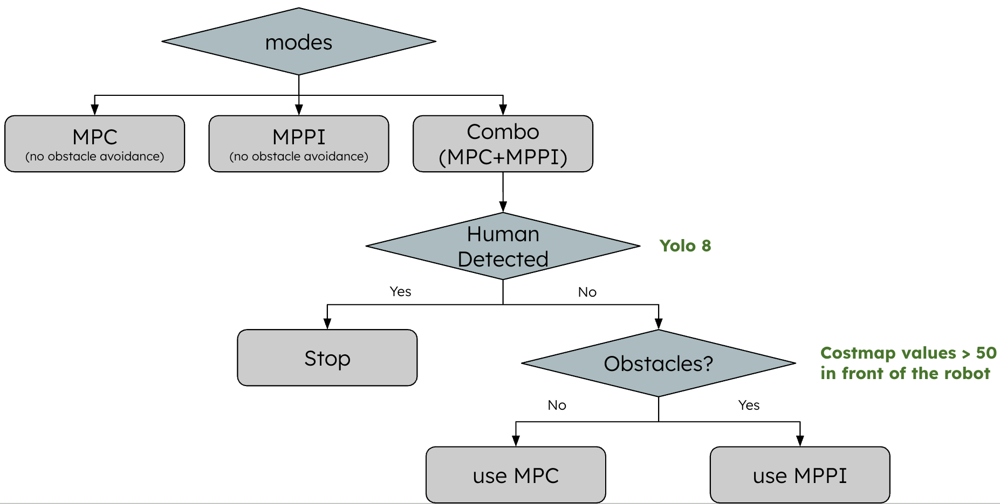

# amiga_local_planner

## Launch

```
ros2 launch amiga_local_planner mpc_mppi_combo.launch.py planner:=combo dry_run:=true
```

**Arguments:**

| Argument | Options | Behavior |
|----------|---------|----------|
| `planner` | `combo` | Full obstacle avoidance — dynamically switches between MPC and MPPI (see flowchart below) |
| | `mpc` | MPC only; no obstacle avoidance. Use for debugging. |
| | `mppi` | MPPI only; no obstacle avoidance. Use for debugging. |
| `dry_run` | `true` | Costmap active, `cmd_vel` held at zero — for visualization and pre-run checks |
| | `false` | Live mode — velocity commands sent to the robot |

---

## Combo Mode — Decision Logic

In `combo` mode, the planner uses a Velodyne lidar and a RealSense camera (YOLOv8) to detect obstacles and people. The lidar is projected onto a 2D costmap; the camera detects people with a stability filter so the robot only stops when a person consistently blocks the path.



**Decision flow:**
1. **Human detected?** (YOLOv8 via RealSense) → Yes: **Stop**
2. **Obstacles ahead?** (any costmap cell cost ≥ 50 within a 4.0 m × 3.0 m box ahead of the robot, from Velodyne) → Yes: switch to **MPPI** (obstacle avoidance) / No: keep using **MPC** (efficient path tracking) because the MPC has better performance compared with MPPI.

---

## Scripts

The launch file `mpc_mppi_combo.launch.py` starts `controller_server` (nav2 pkg), which does two things: (1) builds the local costmap from `/velodyne_points` using `costmap.yaml`, and (2) runs the MPPI controller configured by `mppi.yaml`, publishing its output to `/local_planner_cmd_vel`.

The launch file also remaps MPC's `cmd_vel` to `/mpc_cmd_vel` so that in combo mode, `cmd_vel_switcher.py` selects between `/mpc_cmd_vel` and `/local_planner_cmd_vel` following the decision flow above, and outputs the final `/cmd_vel` to drive the robot.

`obstacle_detector.py` scans the costmap ahead of the robot and publishes `/obstacle_nearby` and `/human_detected` to trigger the switching logic in `cmd_vel_switcher.py`.

`path_relay.py` forwards MPC's `/aPath` to `controller_server` via the `FollowPath` action, so MPPI knows which path to follow.


## Tuning the configs

- **`costmap.yaml`**
  - Map size: 100 × 100 m rolling window visualized in Rviz2.
  - Footprint set to the Amiga's full bounding box (`±0.65 m × ±0.82 m`) so collision checks cover the whole body range.
  - Obstacle layer max height: 2.0 m — sufficient for field obstacles.
  - Velodyne `obstacle_max_range` 45.0 m, `raytrace_max_range` 50.0 m — raytrace range slightly higher than marking range to ensure stale voxels are always cleared.
  - `inflation_radius` and `cost_scaling_factor` are directly used by `ObstaclesCritic` in `mppi.yaml` via controller_server.

- **`mppi.yaml`**

  **How MPPI works (brief):**

  MPPI samples `batch_size` trajectories by adding Gaussian noise to the nominal control sequence. Each trajectory is evaluated by summing critic costs over the horizon (`time_steps × model_dt`).

  ---

  **Rollout parameters:**

  | Parameter | Value | Notes |
  |-----------|-------|-------|
     | `model_dt` | 0.05 s | Simulation timestep |
  | `time_steps` | 80 | Planning horizon = 80 × 0.05 s = **4.0 s** |
  | `batch_size` | 4000 | Number of sampled trajectories — more = better avoidance, higher CPU |
  | `iteration_count` | 2 | Refinement passes per control step |
  | `temperature` | 0.2 | Controls how sharply low-cost trajectories are preferred — lower value means the best trajectory dominates more strongly; higher value blends more trajectories together |
  | `gamma` | 0.015 | Control cost regularization |
  | `motion_model` | `DiffDrive` | Matches Amiga skid-steer kinematics |
  | `visualize` | true | Publishes `/trajectories` for RViz |

  **Noise (exploration):**

  | Parameter | Value | Notes |
  |-----------|-------|-------|
  | `vx_std` | 0.2 m/s | How much speed variation to try — larger = more aggressive speed changes sampled |
  | `wz_std` | 0.3 rad/s | How much turning variation to try — larger = samples wider turns, better avoidance but more oscillation on straight paths |
  | `vy_std` | 0.0 | Fixed at zero — skid-steer has no lateral motion |

  **Velocity limits:**

  | Parameter | Value |
  |-----------|-------|
  | `vx_max` | 0.3 m/s |
  | `vx_min` | −0.1 m/s |
  | `wz_max` | 1.2 rad/s |

  ---

  **Critics:**

  Each critic contributes to the total trajectory cost by a weighted sum.

  | Critic | Weight | Power | Role |
  |--------|--------|-------|------|
  | `ConstraintCritic` | 4.0 | 1 | Penalizes velocity constraint violations |
  | `ObstaclesCritic` | repulsion: 50, critical: 100, collision: 1000 | 1 | Inflation cost: weight 50 (far) → 100 (close); collision cost: flat +1000 if lethal cell |
  | `GoalCritic` | 500.0 | 1 | Pulls trajectory toward goal position (active within 1.4 m) |
  | `GoalAngleCritic` | 500.0 | 1 | Aligns heading at goal (active within 0.5 m) |
  | `PathAlignCritic` | 15.0 | 1 | Keeps trajectory aligned to path orientation |
  | `PathFollowCritic` | 50.0 | 1 | Tracks progress along path |
  | `PathAngleCritic` | 2.0 | 1 | Penalizes large heading deviation from path |
  | `PreferForwardCritic` | 10.0 | 1 | Discourages backward motion |

